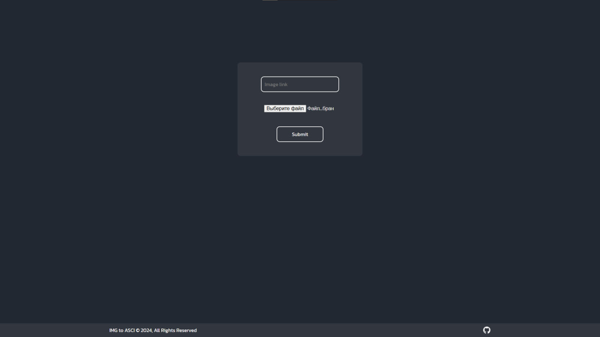

# React&FastApi Img to ASCII

## Description
The ASCII Art Converter is a web application that allows users to upload images by link or file and convert them into ASCII art. The app utilizes a React frontend for a responsive user interface and a FastAPI backend for efficient image processing.

## Features
- Image Upload: Users can easily upload images from their devices. The frontend handles
  file input and provides a preview of the uploaded image.

- Conversion Process:
  - The uploaded image is sent to the FastAPI backend.
  - FastAPI processes the image, converting it into ASCII art using specific algorithms.
  - The resulting ASCII art is returned to the frontend.

- Responsive Design: Built with React, the app features a clean and intuitive
  interface that works well on both desktop and mobile devices.


## Tech Stack

**Frontend:** React, TailwindCSS

**Backend:** FastAPI

**Image Processing:** Pillow

## Installation

Clone my project
```cmd
    git clone https://github.com/Fialex1212/react-fastapi-todo.git
```

### Frontend
Run the frontend

```bash
  cd frontend
  npm install
  npm run dev
```

### Backend
Run the backend

```cmd
  cd backend
  python -m venv venv
  .\venv\scripts\activate
  pip install requirements.txt
  uvicorn src.main:app
```

### Docker
Run the docker-compose

```cmd
  docker-compose up --build
```

## API Reference

### Ping

```
  GET /ping
```

#### Response example
```
{
  "message": "PONG"
}
```

### Read Filename

```
  GET /read-filename
```

| Parameter | Type       | Description                        |
| :-------- | :--------- | :--------------------------------- |
| `file`    | `UploadFile` | **Required**. Image file to extract the filename |

#### Response example
```
{
  "filename": "image.jpg"
}
```

### Conver image to .txt file by image

```
  POST /get-txt-by-img-file
```

| Parameter | Type       | Description                                      |
| :-------- | :--------- | :----------------------------------------------- |
| `file`    | `UploadFile` | **Required**. Image file to extract text from |

#### Response example
```
{
  file in .txt format
}
```

### Conver image to .txt file by url

```
  POST /get-txt-by-img-url
```

| Parameter | Type     | Description                                  |
| :-------- | :------- | :------------------------------------------- |
| `url`     | `string` | **Required**. URL of the image to extract text from |

#### Response example
```
{
  file in .txt format
}
```


## Screenshots




## Authors

- [@Aleks Seriakov](https://github.com/Fialex1212)

